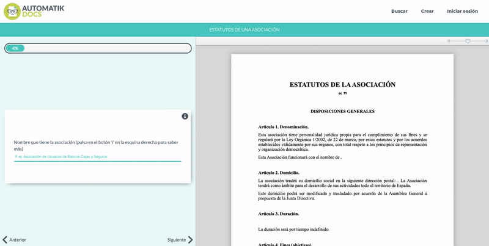

# [Automatik Docs](https://www.automatikdocs.com/)

<p align="center">
  
</p>
<p>
    The purpose of the page is the automatic creation of documents by filling forms. As the user fills a form, a legal doc is created in real time as it can be seen in the example below:
</p>
<br/>
<kbd>
    
</kbd>
<br/>
<br/>

## Front-end
<p>In order to optimize the SEO of the page I use Server Side Rendering with <strong>Angular Universal</strong>.</p>

### Installation

#### Project setup
```
cd client
npm install
```
### Compiles and hot-reloads for development

```
ng serve
```
#### Deploy
Files are compiled directly to the `./server/public` folder which are going to be deployed to heroku. Run:
```
npm run build:ssr
```

## Back-end
The backend is quite simple, an <strong>Express</strong> API using <strong>Mongo DB</strong> with a passport strategy for authentication. The api is passed to the Angular universal Server as it can be seen here:
https://github.com/juancamejoalarcon/automatikdocs/blob/master/server/app.js#L128

### Installation
#### Project setup
```
cd server
npm install
```

### Compiles and hot-reloads for development

To use the api, without testing the statics compiled by Angular Universal
```
npm run local
```
To user the Server created by Angular Universal
```
npm run local:universal
```

## E2E
<p>I created a series of e2e tests with <strong>Cypress</strong> to be launched in <strong>Github Actions</strong> once every day and every time I push a commit.</p>
<p>I deployed the webapp in Heroku.</p>

## Deploy
I created a BASH script to automate the deploy to heroku. Just have to use one of these commands depending on the environment:

```
bash deploy.sh dev
```
```
deploy.sh prod
```

<p>The live version can be found here <a href="https://www.automatikdocs.com/" target="_blank">https://www.automatikdocs.com/</a></p>
